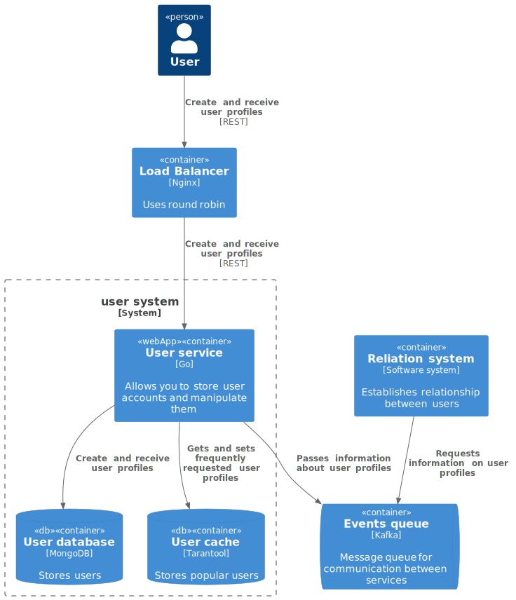
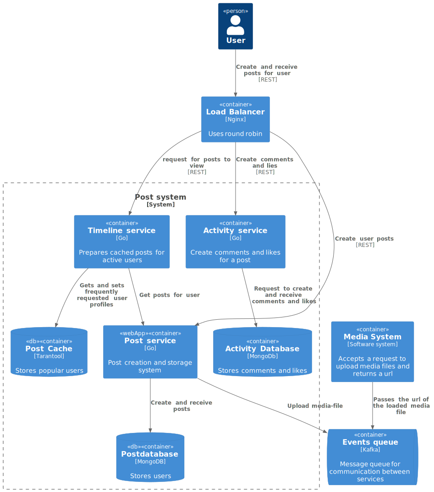
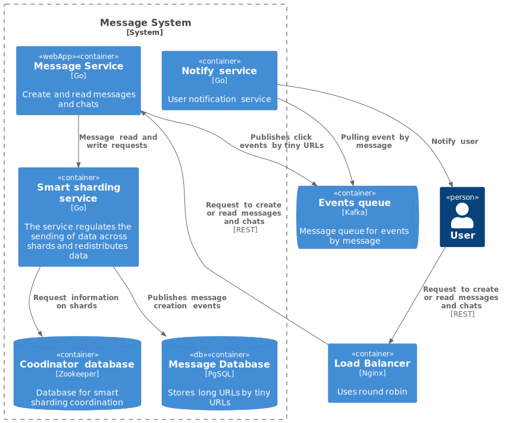
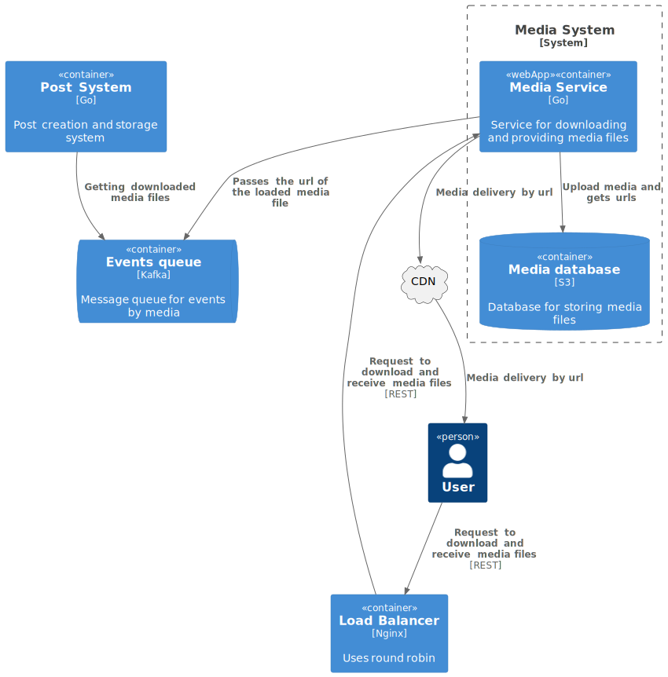
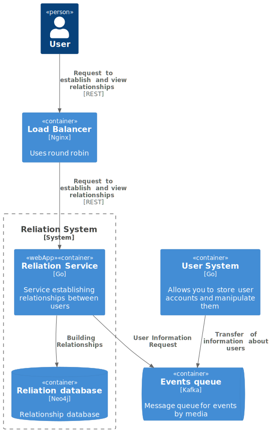

# Social Network System Design

Домашнее задание по [курсу System Design](https://balun.courses/courses/system_design). Базовый API социальной сети.

### Функциональные требования:
- добавление и удаление друзей;
- просмотр друзей пользователя;
- просмотр анкеты пользователя;
- публикация поста в ленту;
- загрузка медиа файлов для постов;
- просмотр ленты постов (*домашней и пользователей)*;
- просмотр диалогов и чатов пользователя;
- отправка и чтение сообщений в диалогах и чатах.

### Нефункциональные требования:
- DAU 50 000 000
- Availability 99,95%
- Посты и сообщения хранеим всегда
- Комментарии не ограничиваем
- Масимальное количество друзей 10 000
- Максимальное количество букв в посте и сообщении 2000
- Один медиа-файл в посте по 1Мб
- В среднем пользователь создает один пост в 5 дней
- Пользователь просматривает ленту 10 раз в день
- Пользователь отправляет 20 сообщений в день
- Пользователь читает сообщения 100 раз в день
- Геораспределенности нет
- Сезонности нет

## Design overview

     <b>Level 1.</b> System context diagram  

  

     <b>Level 2.</b> User system container diagram  

 

  

     <b>Level 2.</b> Post system container diagram  

 

  

     <b>Level 2.</b> message system container diagram  

 

  

     <b>Level 2.</b> media system container diagram  

 

  

     <b>Level 2.</b> relation system container diagram  

 

  

## Базовые расчеты

### Посты
RPS posts (write):

	DAU = 50 000 000
	В среднем пользователь создает 1 пост раз в 5 дней
	RPS = 50 000 000 / 86400 / 5 = 115
RPS posts (read):

	DAU = 50 000 000
	Пользователь просматривает ленту 10 раз в день
	RPS = 50 000 000 * 10 / 86400 = 5787

Traffic (write):

	Traffic = 115 * 4000 = 460 КБ/c
	Traffic (media) = 115 * 1Мб = 115 Мб/c
	
	Created posts for 1 year = 365 * 115 * 86400 = 3 626 640 000
	Required memory for 1 year (media) = 3 626 640 000 * 1Мб = 3.6 PB
	Required memory for 1 year (post) = 3 626 640 000 * 2Кб = 7.2 TB

### Сообщения
RPS (write):

	DAU = 50 000 000
	Пользователь отправляет 20 сообщений в день
	RPS = 50 000 000 * 20 / 86400 = 11 574
RPS (read):

	DAU = 50 000 000
	Пользователь читает сообщения 100 раз в день
	RPS = 11 574 * 5 = 57 870
	
Traffic (write): 

	Traffic = 11574 * 4000 = 46Mb/s
	Created message for 5 year = 11574 * 365 * 86400 = 364 997 664 000 * 5 = 1 824 988 320 000
	Required memory for 5 year = 46 * 365 * 86400 = 1.5 PB * 5 = 7.5 PB
	
Shards:

	Возьмем HDD на 16 TB. Объединим в рейд по 50 диск. Количество памяти на шард:
	Memory for 1 shard = 800 TB
	Shards = 7500 TB / 800TB = 10
